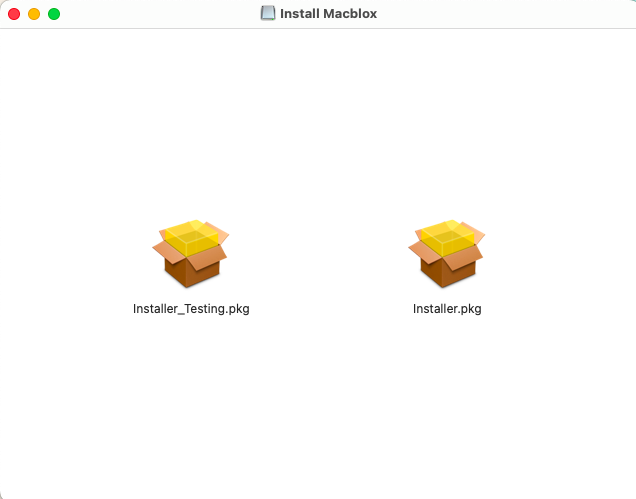

import DownloadLink from '@site/src/components/DownloadLink';

# Installing Macblox

Installing Macblox is very simple just press the button to download the file!
<DownloadLink />
  
Once you downloaded the file open it in Finder and it should look like this

  
If you want to use the testing branch just use the Installer_Testing.pkg

If you want to use the release branch just use the Installer.pkg

Follow the installer and thats it! You've installed Macblox!
